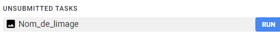

# Récolte d'images de Landsat à l'aide d'un script Google Earth Engine 

<a href="https://code.earthengine.google.com/8f8a363aa18fa9d16c1fe84991aa4154">ce script</a> <br>
<a href="https://www.youtube.com/watch?v=t88PpJEKteQ">la vidéo explicative (explication à partir de 21:11)</a> <br>
<a href="https://appliedsciences.nasa.gov/sites/default/files/2022-08/UHI_Part1_Final.pdf">Les slides de la vidéos</a> <br>

<b>! Pour avoir accès au script il faut créer un compte GEE ! </b> <br>

Le script permet de récolter les <b>Land surface temperatures(LST)</b> de la région choisie. à part d'image du satellite Landsat d'une période choisie le script fait une moyenne des température recensée (en enlevant les image où la proportion de nuage est trop élevée) et montre une carte, également en sélctionnant correctement les zones urbaines et les zones rurales, le script permet d'avoir le max le min et la moyenne de ces zones (pour le calcul d'ilot de chaleur(vu que c'est la différence entre la ville et la campagne environnante qui donne ces chiffres))

 ### 1. Selectionner L'Area of interest et définir les zones urbaines/rurales

Il faut sélectionner L'aoe, les zones urbaines et rurales. L'aoe c'est l'espace qui t'intéresse pour ta carte. Attention à respecter les bons noms de couches dans les  geometry import. Le plus simple c'est de sélectionner les polygones existant et les supprimer puis choisir chaque couche et redessiner les polygones à l'endroit qui t'intéresse


Ici le carré gris représente la zone à analyser, le polygone vert les espaces urbains et les polygones orange les espaces ruraux ( ici c’est dessiné à l’arrache mais si on veut être plus précis on peut importer des polygones exacts des différentes zones) 

### 2. Rajouter le code qui permet d'exporter la carte en Geotiff

Si tu run le code maintenant tu vois l'image apparaitre sur la carte de GEE, mais tu as aucune manière de l'exporter. c'est ici qu'il faut rajouter ce bout de code : (voir <a href="https://developers.google.com/earth-engine/guides/exporting#configuration_parameters">cette page</a> pour plus d'infos sur l'export en général dans GEE)

```
Export.image.toDrive({
  image: clip_mean_ST,
  description: 'Nom_de_limage',
  crs: "EPSG:3857",
  fileFormat: 'GeoTIFF',
  formatOptions: {
    cloudOptimized: true
  }
});

```

<b>Attention ce bout de code doit être rajouté après la création de la variable ``` clip_mean_ST``` <b>

### 3. Télécharger le fichier 

Maintenant il faut run le script, ça prendra un peu de temps mais quand c'est fait: il faut aller dans l'onglet task et le nom de ton fichier apparaitra il faut encore une fois appuyer sur run et tu retrouveras ce fichier dans ton drive (google)




Voilà maintenant que tu as le géotiff télécharger tu vas pouvoir l'ouvrir et le transformer en geojson avec Rasterio et geopandas <a href="./geotiff.ipynb"> ici</a>